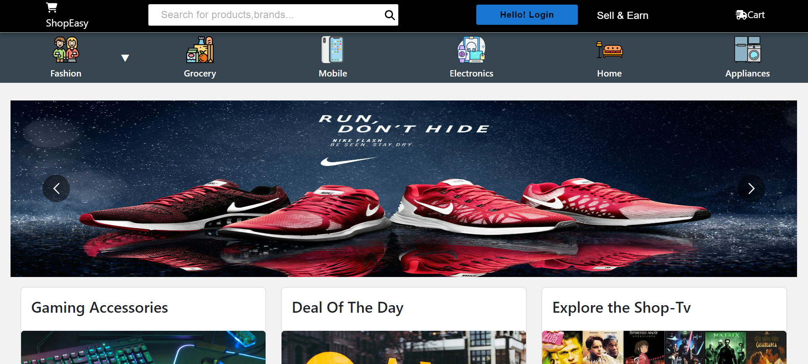
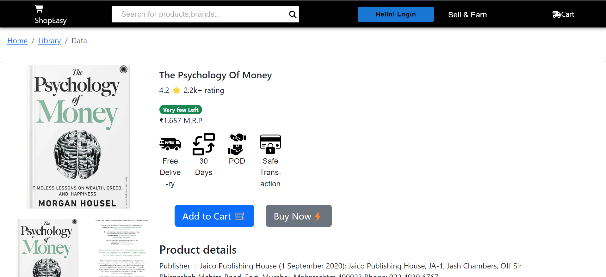

# ShopEasy - E-commerce Website




Welcome to ShopEasy, your one-stop solution for buying various products available online. This project is built with React.js, MongoDB, and integrates third-party APIs and payment gateways to streamline the checkout process.

## Table of Contents

- [Demo](#demo)
- [Features](#features)
- [Technologies Used](#technologies-used)
- [Installation](#installation)
- [Usage](#usage)
- [Contributing](#contributing)
- [License](#license)


## Features

- User Authentication (Sign up, Login, Logout)
- Product Search and Filtering
- Product Details Page
- Shopping Cart Management
- Secure Checkout with Payment Gateway Integration
- Order History for Users
- Admin Dashboard for Product Management

## Technologies Used

- Frontend:
  - React.js
  - Material-UI
  - Redux

- Backend:
  - Node.js
  - Express.js
  - MongoDB

- Others:
  - Third-party APIs
  - Payment Gateway Integration (e.g., Stripe, PayPal)

## Installation

To get a local copy up and running follow these simple steps:

### Prerequisites

- Node.js installed
- MongoDB installed and running

### Backend Setup

1. Clone the repo
   ```sh
   git clone https://github.com/moto23/ShopEasyWeb.git
   cd shopeasy
